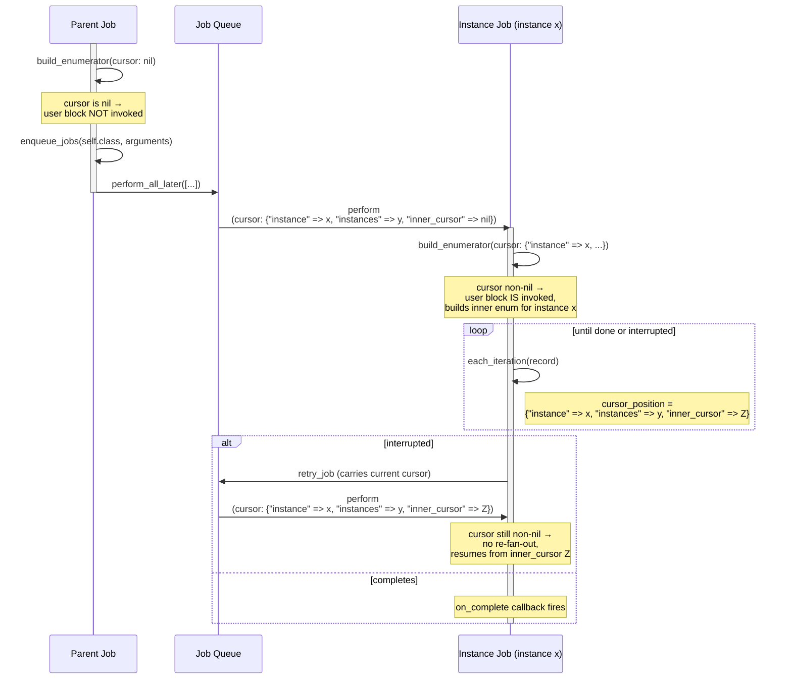

# Parallel iteration

Parallel iteration allows you to split work between multiple jobs running in parallel. If you have to backfill a table with millions of records and it would take days to process with a single iterating job, that work could be done in hours with 10 parallel jobs, each iterating over a tenth of the table.

## How do I use it?

### Iterating over Active Record relations

To iterate over the `users` table with 10 parallel jobs, write your job like this:

```ruby
class ParallelUserIterationJob < ApplicationJob
  include JobIteration::Iteration
  
  def build_enumerator(cursor:)
    enumerator_builder.parallel_active_record_on_records(User.all, instances: 10, cursor: cursor)
  end

  def each_iteration(user)
    user.notify_about_something
  end
end
```

Aside from the new `instances` argument, `parallel_active_record_on_records` enumerator takes the same arguments as the normal `active_record_on_records` enumerator, so you can add `where` clauses to the scope and change the columns used for ordering with `columns`. The only caveat is that parallel iteration requires a single integer primary key to effectively distribute the work between instances, so a table with a UUID primary key or a composite primary key won't work.

There is also a `parallel_active_record_on_batches` enumerator that iterates over the relation in batches, which takes the same arguments as the normal `active_record_on_batches` enumerator in addition to the `instances` argument.

> [!WARNING]
> On most database backends, each instance has to do a full primary key scan and discard non-matching rows, so total database load grows linearly with the number of instances.

### Iterating over arrays

The other built-in parallel enumerator is the parallel array enumerator. You can use it as follows:

```ruby
class ParallelAlphabetIterationJob < ApplicationJob
  include JobIteration::Iteration
  
  def build_enumerator(cursor:)
    enumerator_builder.parallel_array(("a".."z").to_a, instances: 4, cursor: cursor)
  end

  def each_iteration(letter)
    # do something with the letter
  end
end
```

### Custom parallel iteration

If the built-in enumerators do not meet your needs, you can roll your own. For example, this iterates over transactions with a VARCHAR `uuid` primary key:

```ruby
class ParallelTransactionIterationJob < ApplicationJob
  include JobIteration::Iteration
  
  def build_enumerator(cursor:)
    enumerator_builder.parallel(instances: 5, cursor: cursor) do |instance, instances, inner_cursor|
      relation = Transaction.where("CRC32(transactions.uuid) % ? = ?", instances, instance)
      enumerator_builder.active_record_on_records(relation, cursor: inner_cursor)
    end
  end

  def each_iteration(transaction)
    transaction.check_if_paid
  end
end
```

When building a custom parallel enumerator, it must follow these rules to behave correctly:

- The block must return an enumerator. This enumerator will be used to iterate over the data in instance jobs, so all the usual rules for enumerators apply.
- The block must use the `instance` and `instances` variables passed to the block. These values are stored in the cursor so that they don't change after the job has started. If you don't do this and a deploy changes the number of instances, existing jobs may silently skip or double-process records.

### Caveats

There are a few subtle things to keep in mind when working with parallel enumerators.

- The parallel enumerators must be the outermost enumerator, they cannot be wrapped in a throttling or nested enumerator.
- Callbacks (`on_start`, `on_complete`, etc.) fire for each instance independently. There is no "all instances have completed" callback.
- Instance jobs have the same class, arguments, `queue_name`, and `priority` as the parent job. Other custom attributes are not automatically copied over.
- If any instance job fails to enqueue, the parent job raises a `ParallelEnumerator::EnqueueError`. Because `perform_all_later` is all-or-nothing in most adapters, it is likely that all instance jobs failed to enqueue, so retrying the parent job is usually appropriate. However, it is technically possible that only some of the instance jobs failed to enqueue, which could lead to unexpected behavior where multiple jobs are running for the same instance.

## Internals

When a parallel iteration job is enqueued, it first runs with a `nil` cursor. That triggers it to enqueue all the instance jobs, each with a cursor that looks like `{ "instance" => x, "instances" => y, "inner_cursor" => nil }`, where `x` ranges from 0 to `y - 1`. When those jobs start, they build the inner enumerator and run as normal, except that the outer enumerator ensures that the cursor stays wrapped in this hash with `instance`, `instances`, and `inner_cursor`.


